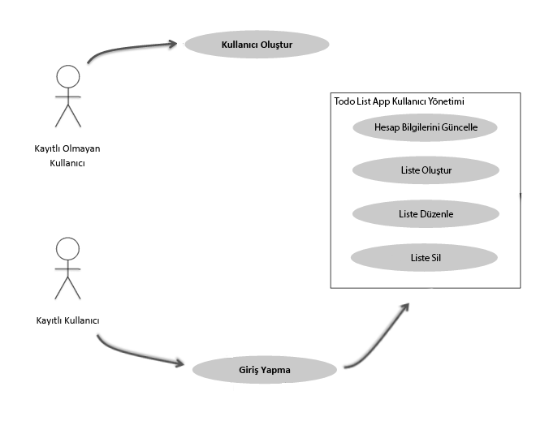

# Durum Diyagramı

### 1. Kullanıcı Girişi Yapılmış Durum
1. Hesabı Sil
2. Hesap Bilgilerini Düzenle
3. Liste Ekle
4. Liste Düzenle
5. Liste Sil
6. Liste Ara

### 2. Kullanıcı Girişi Yapılmamış Durum
1. Kullanıcı Oluştur

 
 

## Geçişler

• *Giriş Yapılmamış Durum → Giriş Yapılmış Durum* (Kullanıcı giriş yaptığında)  
• *Giriş Yapılmış Durum → Giriş Yapılmamış Durum* (Kullanıcı çıkış yaptığında)  

 
 

[README'ye dön](../README.md) 