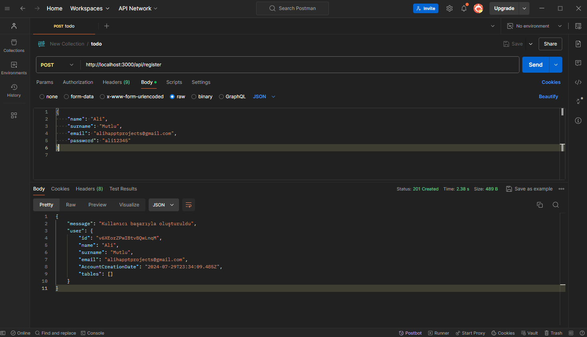
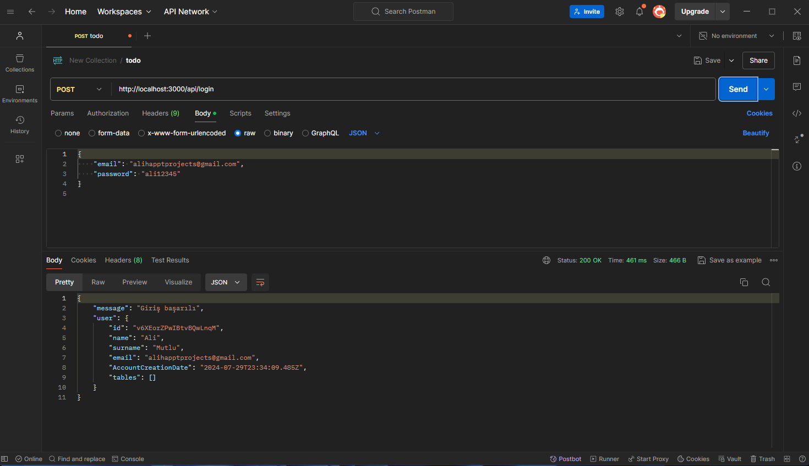
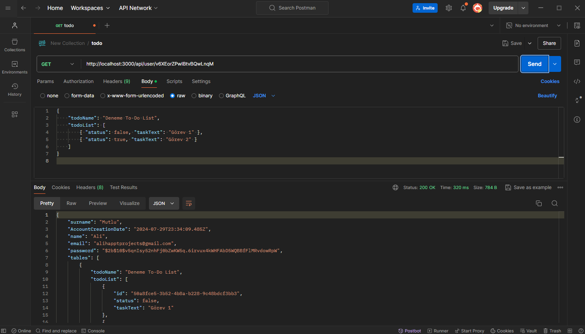
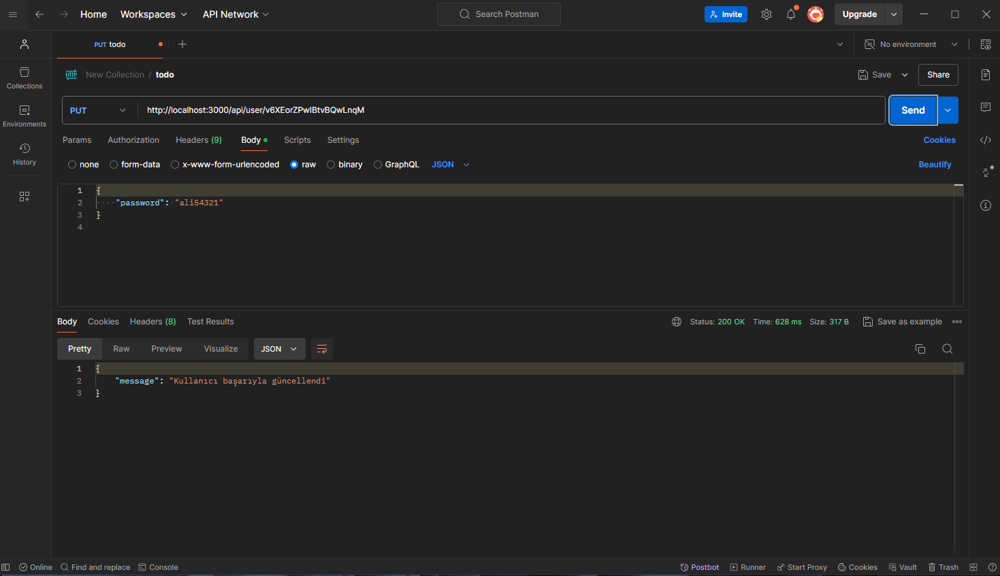
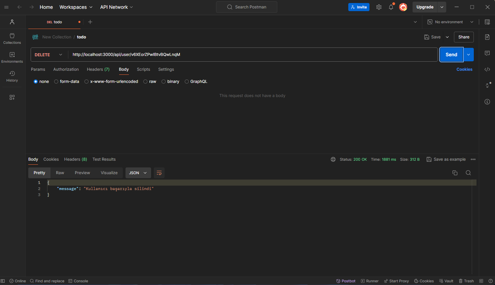
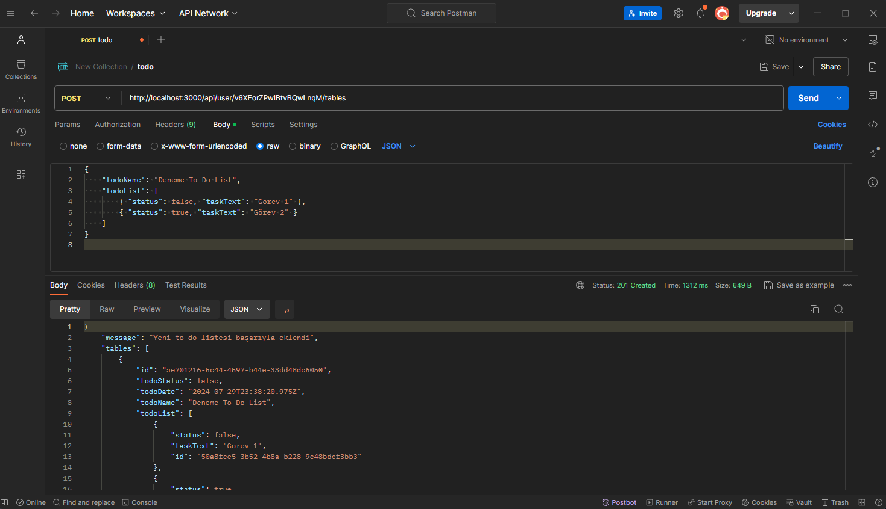
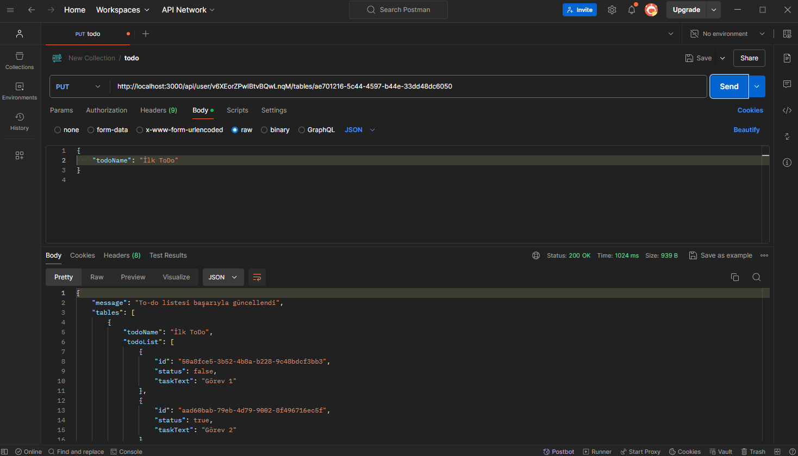
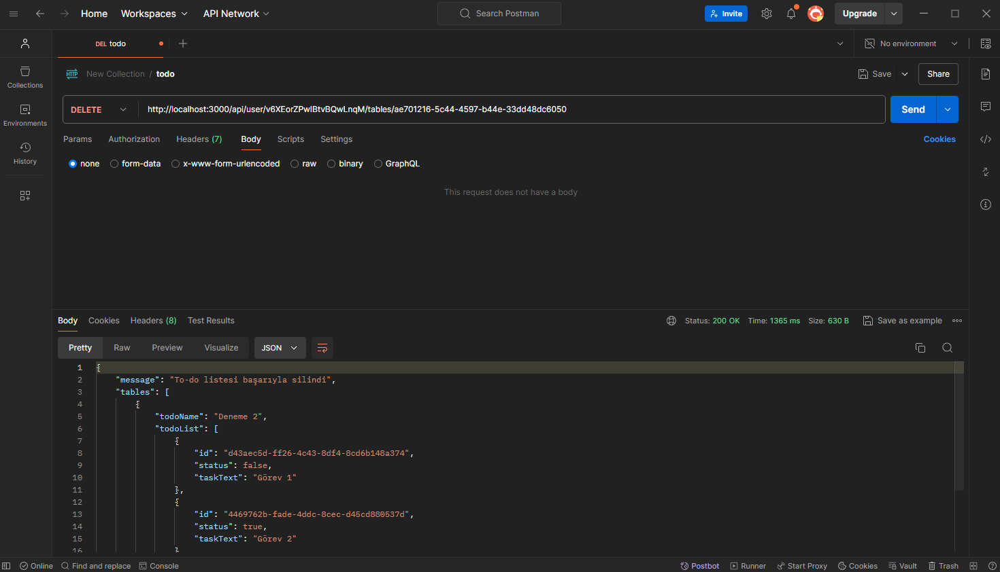
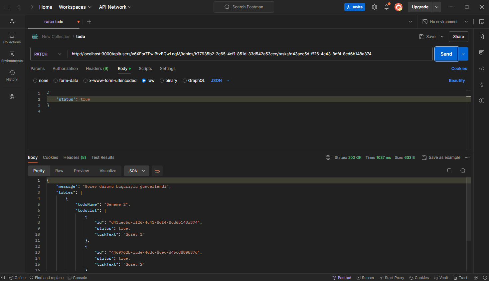

**Kullanıcı Kaydı:** POST: .../api/register  

 

**Kullanıcı Girişi:** POST: .../api/login  

 

**Kullanıcı Bilgilerini Alma:** GET: .../api/user/:userid  

 

**Hesap Bilgilerini Güncelle:** PUT: .../api/user/:userid  

 

**Hesabı Sil:** DELETE: .../api/user/:userid  

 

**Yeni Todo List Ekle:** POST: .../api/user/:userid/tables  

 

**Todo List Güncelle:** PUT: .../api/user/:userid/tables/:tableid  

 

**Todo List Sil:** DELETE: .../api/user/:userid/tables/:tableid  

 

**Todo List Sil:** DELETE: .../api/users/:userId/tables/:tableId/tasks/:taskId  

 
 
 
 

[README'ye dön](../README.md) 